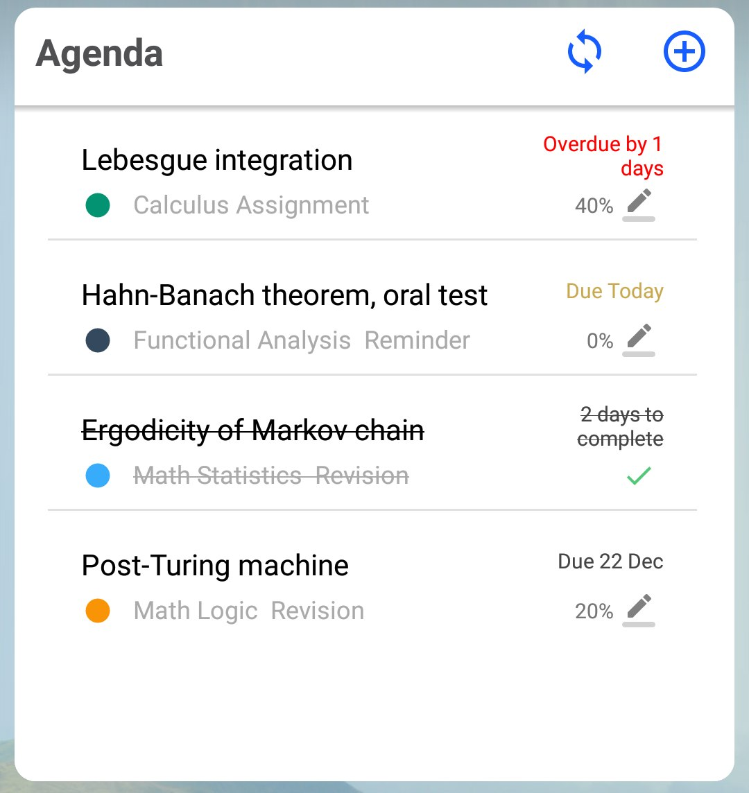
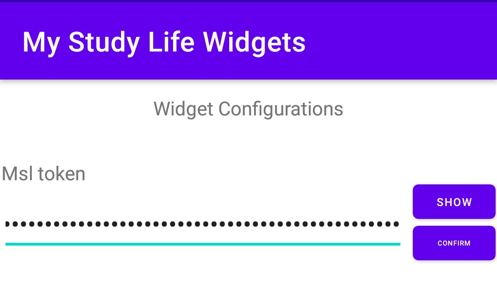

# My Study Life Widget (Agenta)

## _A **Vital** Addition To The [My Study Life](https://www.mystudylife.com) App_

 

App provide you with widget for waching tasks from _HomeScreen_. 
You can update, finish or undo task from widget. 

Note:
> This app is just a brew project, made to enhance 
> the functionality of [base application](https://www.mystudylife.com).

## Dependencies/Installation
* _Minimum system requirements_: 
    * Android 8.0 Oreo
    * 2 Gb of RAM
    
* For proper work of widget, you need to have [**My Study Life account**](https://accounts.mystudylife.com/sign-up).

* You have to find **Msl server access token**.

    Your My Study Life Token will look something like "xxxxxxxxxxxxxxxxxxxxx:xxxxxxxxxxxxxxxxxxxxx="
    Found in the local storage (under Chrome Developer Tools - Application in Chrome) as '_'
    accessible via Chrome developer console via `localStorage._`
    
* Next, install [app](releases/tag/1) and paste token in input field, and press _"Confirm"_:

    
    How to install apps from apk, you can read [here](https://www.expressvpn.com/support/vpn-setup/enable-apk-installs-android/).
    
* Last step, place widget on homescreen, press _"Refresh button"_, or on any available task.

* __Strong recommendation__, to install [eponymous android application](https://play.google.com/store/apps/details?id=com.virblue.mystudylife&hl=en&gl=US) too.
_Some functionality, would be unavailable otherwise._

_P.s. If you done instruction step by step, but widget is not working, check your token once more,
they have tendency to change from time to time :)_

## Issues _(ops, I mean features :relaxed:)_

- If you haven't touched the widget for a while, and after tapping on it, you see **some app launching and then immediately hiding**,
    do not worry, _it's ok_, it's just that your device closed the widget app in the background, so we need to open it again. **Wait a second and click on the widget again**. 

 # Hope my app would be usefull for you, thanks for using it. :yellow_heart:
